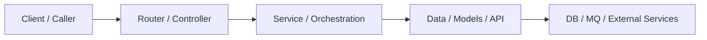

# Output Templates

## Single-Service Wiki Template

```markdown
# <Service Name> System Design Wiki

## 1. Goal
## 2. Service Overview
## 3. High-Level Architecture
## 4. Layered Model
## 5. Core Modules
## 6. Interaction Contracts
## 7. Representative Execution Flows
## 8. Entry Map
## 9. Key ID Lifecycle
## 10. High-Risk Boundaries
## 11. Conclusion
```

### Notes

- Use `Entry Map` when routes, MQ callbacks, commands, or tasks are meaningful
- Use `Key ID Lifecycle` when async tasks, callbacks, or cross-layer joins exist

## Multi-Service Wiki Template

```markdown
# <Repository Name> System Design Wiki

## 1. Goal
## 2. Repository Overview
## 3. Service Catalog
## 4. High-Level Architecture
## 5. Shared Layered Model
## 6. Functional Clusters / Domains
## 7. Core Interaction Contracts
## 8. Representative Execution Flows
## 9. Entry Maps by Service
## 10. Key ID Lifecycle
## 11. High-Risk Boundaries
## 12. Conclusion
```

## Contract Paragraph Template

Use this structure when describing a contract:

```markdown
### <Module or Service Pair>: <Contract Name>

This boundary exists so that `<owner>` owns `<decision>` while `<consumer>` owns `<input/output or protocol>`.

Typical flow:
1. ...
2. ...
3. ...

Stable anchors:
- `<id or field>`
- `<payload or state>`

Change risk:
- If `<thing>` changes, `<affected modules>` must also be checked.
```

## Key ID Lifecycle Table Template

```markdown
| ID | Where It Is Created | Where It Flows | Where It Is Persisted | Why It Matters |
|---|---|---|---|---|
| `taskId` | service/api | callback/workflow/downstream | model/cache/log | async task tracking |
| `businessId` | production service | bind/publish/update flows | resource store | cross-service resource identity |
```

## Mermaid Diagram Template



Prefer responsibility flow over physical deployment diagrams unless the user explicitly wants deployment topology.
