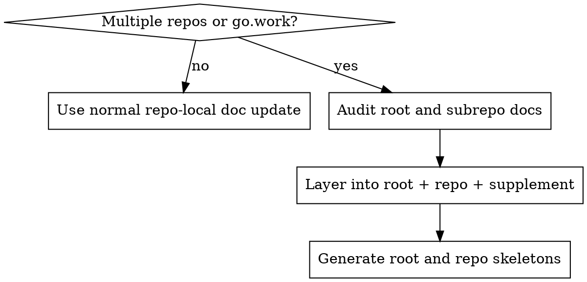

# Multi-Repo CLAUDE Governance

This skill helps Claude govern `CLAUDE.md` and `AGENTS.md` in a multi-repo workspace without collapsing everything into one single-repo template.

The goal is not to write longer documents.
The goal is to keep workspace-wide rules at the root, repo facts near the owning repo, and narrow tool/agent supplements in `AGENTS.md`.

## When to use

Use this skill when the user asks to:

- inspect many `CLAUDE.md` or `AGENTS.md` files across one workspace
- unify, clean up, or de-duplicate multi-repo guidance
- generate a better root `CLAUDE.md` for a `go.work` or coordination root
- generate subrepo `CLAUDE.md` skeletons without repeating root rules
- stop drift between workspace-level and repo-level documentation

Do not use this skill for:

- a one-off edit to a single repo-local `CLAUDE.md`
- pure code changes unrelated to documentation governance
- project-specific coding conventions that belong directly in one repo file

## Core principle

Treat documentation as a layered system:

- root `CLAUDE.md` = workspace routing and shared governance
- subrepo `CLAUDE.md` = repo-local facts
- `AGENTS.md` = narrow supplements, generated blocks, or agent/tool-specific constraints

If you mix those layers, the docs drift and agents route work incorrectly.

## Workflow

### Phase 1: Detect workspace shape

Before proposing any text, inspect the root and answer:

- is this a single repo or a multi-repo workspace?
- is there a `go.work`, multiple `go.mod` files, or several sibling service repos?
- which directories are real repos, and which are shared workflow/support assets?
- which repos are actual `go.work` members, and which are only colocated sibling repos?

If the root is a workspace, do **not** write a single-service template at the root.
Do not collapse `go.work` members and colocated sibling repos into one undifferentiated list.

### Phase 2: Inventory guidance files

Collect:

- root `CLAUDE.md`
- root `AGENTS.md`
- repo-local `CLAUDE.md`
- repo-local `AGENTS.md`
- supporting workflow assets if relevant, such as `.claude/skills/`, `docs/`, or `openspec/`

Group each file into one of these states:

- accurate and useful
- stale but salvageable
- duplicate of another file
- too thin to guide repo-local work
- missing but needed

### Phase 3: Classify the content

For each major rule block, decide where it belongs.

**Root `CLAUDE.md`:**
- workspace topology
- which repos are `go.work` members vs colocated sibling repos
- repo routing rules
- shared process guidance
- broad engineering rules that truly apply across repos

**Subrepo `CLAUDE.md`:**
- repo purpose
- build/test commands
- real entrypoints
- actual top-level directories
- repo-specific cautions

**`AGENTS.md`:**
- generated GitNexus blocks
- narrow tool routing
- agent-only supplements that should not dominate hand-maintained docs

If a block is repo-local, do not leave it at the workspace root.
If a block is generated or tool-specific, prefer `AGENTS.md` over a large hand-maintained `CLAUDE.md` section.

### Phase 4: Find the real problems

Explicitly look for:

- root docs that describe a workspace as one service
- fake or missing paths such as nonexistent `conf/app`, `sql`, or `router/command`
- copied blocks repeated between `CLAUDE.md` and `AGENTS.md`
- build/test commands presented as universal when they are repo-specific
- files that contain only generated content but no repo-local facts

Do not stop at “there is duplication.”
Name the wrong assumption and which layer should own the fix.

### Phase 5: Propose the layered rewrite

Recommend the smallest stable rewrite:

1. rewrite the root file to workspace scope
2. keep or add minimal repo-local `CLAUDE.md` files
3. leave `AGENTS.md` as the supplement layer
4. avoid bulk deleting files unless they are clearly obsolete

Prefer `root + subrepo skeletons` over `one giant root file` or `fully duplicated per-repo manuals`.

## Output format

When reporting findings, use this structure:

### 1. Workspace summary
- what kind of workspace this is
- which directories are real repos
- which directories are shared support assets

### 2. Problem list
- stale root assumptions
- stale repo-local assumptions
- duplicate guidance
- missing guidance

### 3. Layering plan
- what belongs in the root `CLAUDE.md`
- what belongs in repo-local `CLAUDE.md`
- what stays in `AGENTS.md`

### 4. Recommended edits
- root file actions
- per-repo file actions
- any missing files to create

### 5. Optional generation plan
If the user asks for generation, produce:
- one workspace-level `CLAUDE.md`
- one minimal skeleton per repo that needs it

## Generation rules

When generating docs:

- verify every referenced directory or file exists
- keep the root file process-oriented and routing-oriented
- keep subrepo files factual and short
- never copy one repo's directory shape into another without verification
- mention sibling repos only when the target repo actually integrates with them

## Common mistakes

- writing a single-service root template for a `go.work` workspace
- stuffing repo-specific build commands into the root file
- copying large generated GitNexus blocks into every hand-maintained section
- rewriting every repo into the same long document
- treating `AGENTS.md` as a second full `CLAUDE.md`

## Decision guide

## Recommended language

When the root is a workspace, say:

> This root is a multi-repo coordination layer, not one buildable service. The root `CLAUDE.md` should route work to the owning repo and describe shared process rules, while each repo keeps its own factual `CLAUDE.md`.

When a repo needs its own file, say:

> This repo needs a local `CLAUDE.md` because its entrypoints, commands, and structure are not universal across the workspace.
